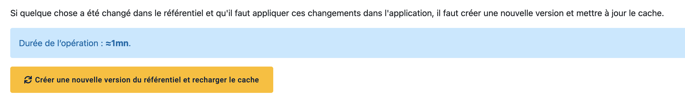

API DU RÉFÉRENTIEL DE CONTENU PÉDAGOGIQUE
=======

# Connecter pix-api à LCMS en local

1. Connecter pix-api à LCMS local en spécifiant dans son .env:

```
LCMS_API_KEY=8d03a893-3967-4501-9dc4-e0aa6c6dc442
LCMS_API_URL=http://localhost:3002/api
```

2. Côté LCMS, indiquer la base Airtable 
   souhaitée dans le .env via `AIRTABLE_API_KEY` et `AIRTABLE_BASE`.
   S'assurer que les autres variables d'environnement **requises** dans le fichier `sample.env` soient aussi renseignées.
   
3. Côté LCMS, démarrer les containers docker et initialiser la base de données:
```
docker-compose up
cd api
npm run db:reset
```

4. Recharger le référentiel de données sur pix-admin > onglet "outils" > Créer une nouvelle version du référentiel et recharger le cache (il s'agit du gros bouton jaune)


